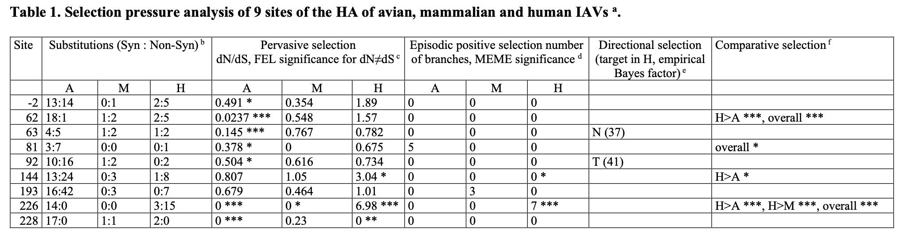

[](https://zenodo.org/badge/latestdoi/387560352)

# Comparative analysis of H3N2 HA sequences
> From _Characterization of changes in the hemagglutinin that accompanied the emergence of H3N2/1968 pandemic influenza viruses_ by Matrosovich et al 

This repository contains primary data, analysis results, and a simple processing script used to summarize site level inference.

### `data` 

* `HA.fas` a multiple sequence alignment of `2701` H3N2 HA nucleoitde sequences in FASTA format. 
* `HA.prot.nex` a protein translation of the above MSA in NEXUS format
* `tree-labeled.nwk` a rooted phylogenetic tree in the Newick format used in the analyses, with branch sets designated in `{}` notation (suitable for analyses using [HyPhy](www.hyphy.org))

### `results`

JSON files produced by `HyPhy` analyses. These can be visualized by the approproate module from [HyPhy vision](http://vision.hyphy.org). Analysis file names contain the method used ([SLAC](http://www.hyphy.org/methods/selection-methods/#slac), [FEL](http://www.hyphy.org/methods/selection-methods/#fel), [PRIME](http://hyphy.org/w/index.php/PRIME), [FADE](http://www.hyphy.org/methods/selection-methods/#fade), [MEME](http://www.hyphy.org/methods/selection-methods/#meme), [CFEL](http://www.hyphy.org/methods/other/evo/#contrast-fel)), and if appropriate -- the set of branches to which the analysis was applied.


```
── results
│   ├── Avian-PRIME.json
│   ├── CFEL.json
│   ├── FEL-avian.json
│   ├── FEL-human.json
│   ├── FEL-mammalian.json
│   ├── FEL-zoonotic.json
│   ├── HA.prot.fas.FADE.json
│   ├── Human-PRIME.json
│   ├── MEME-avian.json
│   ├── MEME-human.json
│   ├── MEME-mammalian.json
│   ├── MEME-zoonotic.json
│   ├── Mammals-PRIME.json
│   ├── SLAC-avian.json
│   ├── SLAC-human.json
│   ├── SLAC-mammals.json
│   └── SLAC-zoonotic.json
```

### `scripts`

Contains a Python3 script which reports selection evidence summary for a specific site in alignment coordiates; the output is tab separated data used to generate Table 1 in the manuscript



```
$python3 scripts/summarize-sites.py -d results -s 15 78 79
-2	13:14	0:1	2:5	0.491 *	0.354 	1.89 	0 	0 	0 		
62	18:1	1:2	2:5	0.0237 ***	0.548 	1.57 	0 	0 	0 		H>A ***, overall ***
63	4:5	1:2	1:2	0.145 ***	0.767 	0.782 	0 	0 	0 	N (37)
```
